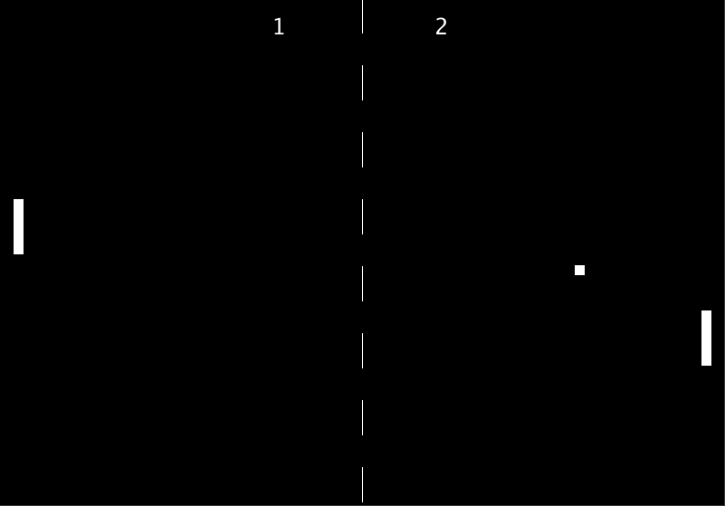

<!-- TABLE OF CONTENTS -->
<details open="open">
  <summary>Tabla de contenidos</summary>
  <ol>
    <li>
      <a href="#Autor">Autores</a>
    </li>
    <li>
      <a href="#Trabajo realizado">Trabajo realizado</a>
    </li>
    <li><a href="#decisiones-adoptadas">Decisiones adoptadas</a></li>
    <li><a href="#referencias">Referencias</a></li>
    <li><a href="#herramientas">Herramientas</a></li>
    <li><a href="#resultado">Resultado</a></li>
  </ol>
</details>


## Autor

El autor de este proyecto son los estudiantes Carlos Eduardo Pacichana Bastidas y Alejandro Daniel Herrera Cárdenes para la asignatura Creando Interfaces de Usuario (CIU) para el profesor Modesto Fernando Castrillón Santana y Jose Daniel Hernández Sosa. 


## Trabajo realizado

El trabajo se basa en hacer un pong en el programa Processing usando el sensor de movimiento de Arduino para jugar.

## Decisiones adoptadas

Las mayores decisiones tomadas y las que mas pruebas requirieron fueron el método para que recogiera el movimiento de la mano la pala del Pong.

* Este método detecta cuando el movimiento de la mano para mover la pala
  ```
  int getSensorDistance() {
  
  int nextPosY = posy;
    if (arduinoPort.available() > 0 && (value = arduinoPort.readStringUntil('\n')) != null) {
      value = value.trim();
      int currentRead;
      try {
        currentRead = Integer.min(Integer.parseInt(value), 500);
      } 
      catch (NumberFormatException e) {
        currentRead = posy;
      }
      if (abs(posy - currentRead) > 10) nextPosY = currentRead;
    }
    return nextPosY;
  }
 <p align="center"></br>Gameplay</p>
 


## Referencias

Para ayudarnos en la realización de esta aplicación usamos la API que te proporciona [Processing](https://www.processing.org/) y [Arduino](https://www.arduino.cc/reference/en/).
## Herramientas

* [Processing](https://www.processing.org/)
* [Arduino](https://www.arduino.cc/reference/en/)


## Resultado

Añadimos un GIF con el resultado de la aplicación final con la escena.

Al ir un poco lento de FPS para realizar el gif usamos el programa [Gyazo](https://gyazo.com/) para que sea más visible el uso del programa. Se puede ver en el link a continuación. El video esta en la carpeta imágenes en caso de que el link no funcione.
* [Vídeo de la ejecución final](https://gyazo.com/dfedc898a8efe06112855498fca09d0e).
